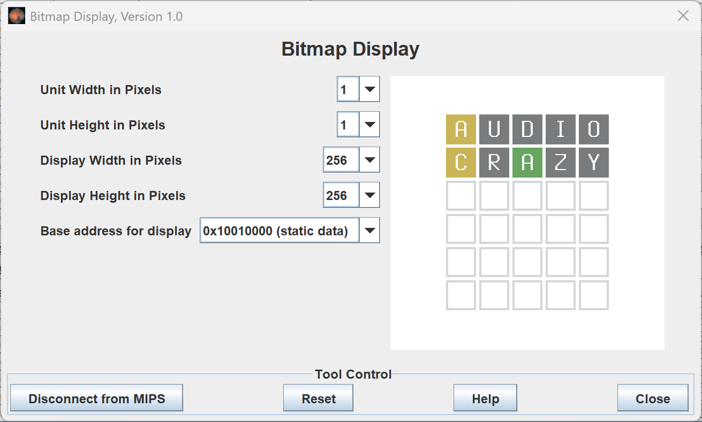
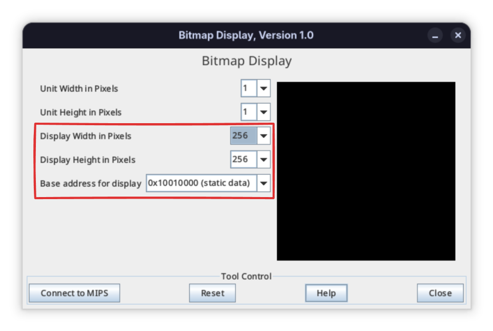
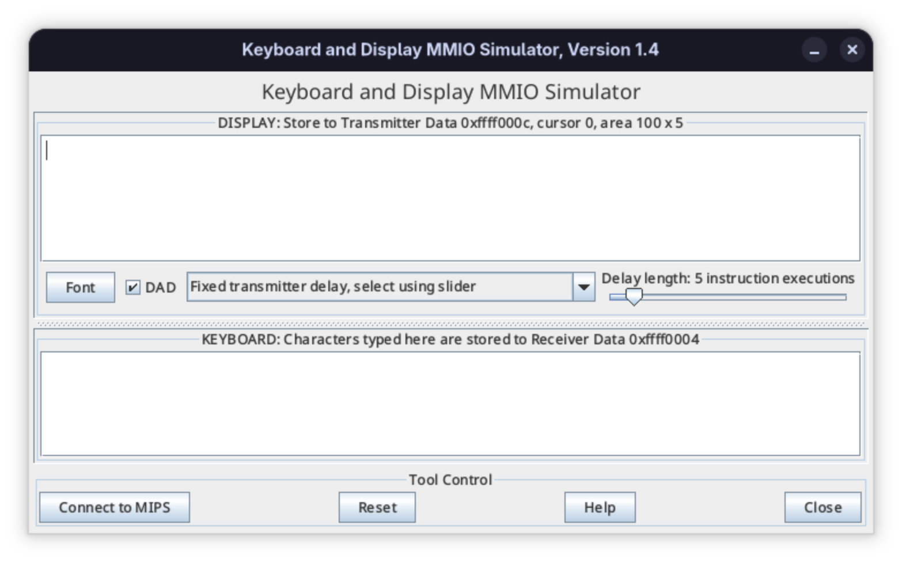

# MIPS Wordle

This project implements the New York Times [Wordle](https://www.nytimes.com/games/wordle/index.html) game in MIPS assembly language. It is intended to be run in the [MARS Simulator](https://dpetersanderson.github.io/).



## Running the Game

To test and run the program, we use the MARS 4.5 Simulator. Our GitHub repository provides a precompiled copy of MARS in the `tools` folder that can be launched using a JDK installation:

```sh
java -jar ./tools/Mars4_5.jar
```

The program in `src/game.asm` can be assembled and debugged using MARS. To view graphical output, use the Bitmap Display tool configured for a 256x256 framebuffer pointed at address `0x100100000` (static data).



Guesses may be submitted using the Keyboard/Display MMIO Tool.

